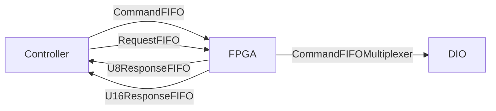

# ts_M1M3ThermalFPGA

## Description

This repo contains the LabVIEW 2018 code of the M1M3 Thermal System FPGA used
by the **ts_M1M3Thermal** software. The FPGA is middleman between [C/C++
control application](https://github.com/lsst-ts/ts_m1m3thermal) and hardware
connected to cRIO.

:warning: Please use **git clone --recursive** to get linked dependencies (Common_ libraries).

## LabView Dependencies

* FPGA Support
* cRIO support
* Real Time support
* [NI Tools Network](https://www.ni.com/labview-tools-network)
  * LabView FPGA Floating-Point Library by NI

If all is installed and setup properly, LabView splash screen will show chip
and clock icons - see [an
example](https://www.evergreeninnovations.co/blog-labview-rt-project/).

:warning: Please use **git clone --recursive** to get linked dependencies (Common_ libraries).

## Build Instructions

Building the FPGA takes just about 45 minutes. As [C++
Controller](https://github.com/lsst-ts/ts_m1m3support) is used to talk to FPGA,
you need to generate C API and transfer the bitfile to cRIO, and C header and
source files to src/LSST/M1M3/SS/FPGA directory. Bitfile is loaded by
NiFpga\_Open call, and contains binary data send to program the FPGA.

It is common for the FPGA build process to get stuck on the *Generate Xilinx
IP* step. To restart the build, kill all Xilinx processes from task manager.

1. Open LabVIEW 2018.
2. Open ts\_M1M3ThermalFPGA.lvproj
3. Expand RT CompactRIO Target
4. Expand FPGA Target
5. Expand Build Specifications
6. Select ts\_M1M3ThermalFPGA
7. Right-Click -> **Build**
8. Select "Use the local compile server" _(it's usually faster than LabView FPGA Compile Cloud)_
9. Click OK
10. Wait for build to successfully finish
  * check CPU usage, there should be process called Vivado taking > 20% CPU time
11. Select ts\_M1M3SupportFPGA.vi (under FPGA Target)
12. Right click, select **"Launch C API Generator"**
13. Click **Generate** (after selecting existing output directory and leaving Prefix blank)
14. Copy resulting NiFpga\_ts\_M1M3ThermalFPGA.lvbitx file to ts\_m1m3thermal/Bitfiles, and NiFpga\_ts\_M1M3ThermalFPGA.h to ts\_m1m3thermal/src/NiFpga
15. Recompile ts\_m1m3thermal (make)

## Overview

The FPGA design makes heavy use of FIFOs and **S**ingle **C**ycle **T**imed
**L**oop (**SCTL**) for critical hardware loops. As FPGA has to sample DIOs
(serial lines, pumps, flow meters,.. ), it's critical those are properly timed
and running all the time. In a classic front/back processing design (see e.g.
Linux Kernel interrupt handling), sampling code just record the values or bits
and bytes and ship them to a FIFO queues for handling. SCTLs, which are
guarantee to take one clock tick, are ideal for handling inputs and outputs.

Receiving (reading) code works by placing values into FIFO. Transmitting
(writing) code works by reading (without timeout) from FIFO, and if something
is available, act accordingly. This is coupled with DIO states (e.g. to make
sure next bit/byte on serial line is transmitted after the current).

Please see [Command codes](docs/CommandCode.md) for communication details.

# Controlled devices

* 96x fan ILCs
  * Modbus bus (marked as F, A-E are support system buses)
  * ILCs, details in LTS-646
  * can set target output temperature and fan speed
* Coolant pump
* Mixing valve
* Coolant flow meter
* Windspeed sensor

**Thermocouples located throughout mirror are readout by separate software.**

## Command multiplexing

Commands, followed by arguments are filled into _Software
Resources/CommandFIFO_. _Commands/CommandFIFOMultiplexer_ read this and
multiplex the command to various handlers _(This is exactly how CPUs handle
instructions from binary code)_. Handlers fills in queues (e.g. ModBus transmit
command pushes bytes to be written into a queue associated with the given bus).
**SCTL**s are handling low level IO. 

## Request multiplexing

Data cannot be read by controller directly (via DMA), but has to be passed
through FIFOs _(usually FPGAs allows DMA to read data directly from memory, but
that doesn't seem to be cause with cRIO design)_. So Controller have to issue
request by writing it to _Software Resources/RequestFIFO_. Responses are read
from _Software Resources/SGLResponseFIFO_, _Software Resources/U8ResponseFIFO_
and _Software Resources/U16ResponseFIFO_.

## Telemetry, Health and Status

Telemetry or Health and Status data are recorded in **STCL**. Telemetry request
(253, _Data Types/Addresses_) dumps 323 U8 values from
_Telemetry/Hardware/Memory_ into _Software Resources/U8ResponseFIFO_. _Memory_
is filled from various FIFOs, which are filled from DIOs - see _Telemetry_.

## Health and Status

See [HealthAndStatusMemory.md](HealthAndStatusMemory.md) for memory content.
To request memory data, write command followed by parameter into
HealthAndStatusControlFIFO. Response to command is written into
HealthAndStatusDataFIFO (U64).

### Health and Status commands

| Command | Parameter | Action                                                            |
| ------- | --------- | ----------------------------------------------------------------  |
|  1      | Address   | Write address content (single U64) into HealthAndStatusDataFIFO   |
|  2      |  N/A      | Write 64 U64 into HealthAndStatusDataFIFO. This is memory content |
|  3      |  N/A      | Clear memory - write 0 to all memory cells                        |

### Health and Status Memory

See [HealthAndStatusMemory.md](HealthAndStatusMemory.md) for memory content.

## Digital Input

**DigitalInput** is very simple process that takes the digital input signals
and samples them every 0.200 ms (5kHz). The trigger for the process can be
found under *DigitalInput/Support/DigitalInputTrigger.vi* which produces a
trigger every 0.200ms and then waits for the sample process to complete. Once a
trigger is produced the *DigitalInput/Support/DigitalInputSampleLoop.vi* will
read the current timestamp and state of all digital inputs and place that
sample into a FIFO. Then at some other point in time the
*Telemetry/Support/TelemetryUpdate.vi* will call the
*DigitalInput/TryUpdateDigitalInputSample.vi* to read from **DigitalInputFIFO**
Sample, Timestamp and Value fields and writes those into three entries in
**DigitalOutputTelemetryFIFO**. **DigitalOutputTelemetryFIFO** is copied into
**TelemetryFIFO**. **TelemetryFIFO** is processed in
*Telemetry/Support/TelemetryMemoryUpdate.vi*, with values written into
*Telemetry/Hardware/Memory*. Once processed, registers *TelemetryEmptyRegister*
and *DigitalTelemetryEmpty* register are true and new sample can be obtained.

Since a SCTL only allows a FIFO writes in one loop and reads in another loop
the design utilizes multiple FIFOs to get around this restriction. In the
example above a digital input sample is pushed into the
*DigitalInputTelemetryFIFO* so that the it can be read by the
*Telemetry/CopyToTelemetryFIFO.vi* loop and pushed into the global
*TelemetryFIFO* which doesn't run inside a SCTL.

The fan coil units (FCUs)  modbus processes are much more complex and rely on
the host machine to parse the data.

# DIO assignment

## Slot 1 - [NI 9207](https://www.ni.com/en-us/support/model.ni-9207.html)

| Port | Assignment            |
| ---- | --------------------- |
| AI0  | CT7 current monitor   |
| AI1  | CT8 current monitor   |
| AI2  | Mixing Valve position |
| AI3  |                       |
| AI4  |                       |
| AI5  |                       |
| AI6  |                       |
| AI7  |                       |
| AI8  |                       |
| AI9  |                       |
| AI10 |                       |
| AI11 |                       |
| AI12 |                       |
| AI13 |                       |
| AI14 |                       |
| AI15 |                       |

## Slot 2 - [NI 9265](https://www.ni.com/en-us/support/model.ni-9265.html)

Mixing valve control.

| Port | Pin | Assignment                     |
| ---- | --- | ------------------------------ |
| AO0  | 0   | Mixing valve set point         |
| COM0 | 1   | COM                            |
| AO1  |     |                                |
| COM1 |     |                                |
| AO2  |     |                                |
| COM2 |     |                                |
| AO3  |     |                                |
| COM3 |     |                                |
| AO4  |     |                                |
| COM4 |     |                                |
| Vsup | 8   | 24 V                           |
| GND  | 9   | GND                            |

## Slot 3 - [NI 9401](https://www.ni.com/en-us/support/model.ni-9401.html)

Fans (96x) ILC Modbus.

| Port | Pin | Assignment                     |
| ---- | --- | ------------------------------ |
|DIO0  | 14  | Subnet F Rx                    |
|DIO1  |     |                                |
|DIO2  |     |                                |
|DIO3  |     |                                |
| Com  | 1   |                                |
|DIO4  | 20  | Subnet F Tx                    |
|DIO5  |     |                                |
|DIO6  |     |                                |
|DIO7  |     |                                |
| COM  | 7   |                                |

## Slot 4 - [NI 9425](https://www.ni.com/en-us/support/model.ni-9425.html)

| Port | Pin | Assignment                     |
| ---- | --- | ------------------------------ |
| DI0  | 1   | PS 14 Status                   |
| DI1  | 2   | PS 15 Status                   |
| DI2  | 3   | PS 16 Status                   |
| DI3  | 4   | Ctrls Redundancy Status        |
| DI4  | 5   | Fan Coils Diffuser Status      |
| DI5  | 6   | AC Power CB15 Status           |
| DI6  | 7   | Utility outlet CB18 Status     |
| DI7  | 8   | Coolant pump OL status         |
| COM  | 17  | COM                            |
| DI16 | 19  | FC heaters off interlock       |
| DI17 | 20  | Coolant pump off interlock     |
| DI18 | 21  | GIS HB loss interlock          |
| DI19 | 22  | mixing valve closed interlock  |
| DI20 | 23  | Support System HB loss         |
| DI21 | 24  | Cell door open interlock       |
| DI22 | 25  | GIS earthquake interlock       |
| DI23 | 26  | Coolant pump e-stop interlock  |
| DI24 | 27  | Cabinet Over Temp interlock    |
| DI25 | 28  |                                |
| DI26 | 29  |                                |
| DI27 | 30  |                                |
| DI28 | 31  |                                |
| DI29 | 32  |                                |
| DI30 | 33  |                                |
| DI31 | 34  |                                |

## Slot 5 - [NI 9485](https://www.ni.com/en-us/support/model.ni-9485.html)

| Port | Pin | Assignment                     |
| ---- | --- | ------------------------------ |
| Ch0a | 0   | Ch0 - Fan Coils / Heaters On   |
| Ch0b | 1   | V Sup                          |
| Ch1a | 2   | Thermal System Controller HB   |
| Ch1b | 3   | V Sup                          |
| Ch2a | 4   | Coolant pump On                |
| Ch2b | 5   | V Sup                          |
| Ch3a |     |                                |
| Ch3b |     |                                |
| Ch4a |     |                                |
| Ch4b |     |                                |
| Ch5a |     |                                |
| Ch5b |     |                                |
| Ch6a |     |                                |
| Ch6b |     |                                |
| Ch7a |     |                                |
| Ch7b |     |                                |

## Slot 6 - [NI 9871](https://www.ni.com/en-us/support/model.ni-9871.html)

4 port RS-485/422. Connected devices are usually using Modbus connection.

| Port | Pin | Assignment                     |
| ---- | --- | ------------------------------ |
| 1    | NA  | Coolant Pump VFD               |
| 2    | NA  | Flow meter                     |
| 3    | NA  | Wind sensor                    |
| 4    | NA  |                                |

## Slot 7 - [NI 9870](https://www.ni.com/en-us/support/model.ni-9870.html)

| Port | Pin | Assignment                     |
| ---- | --- | ------------------------------ |
| 1    | NA  | Glycol temperature 8ch         |
| 2    | NA  |                                |
| 3    | NA  |                                |
| 4    | NA  |                                |

## Slot 8 - empty
