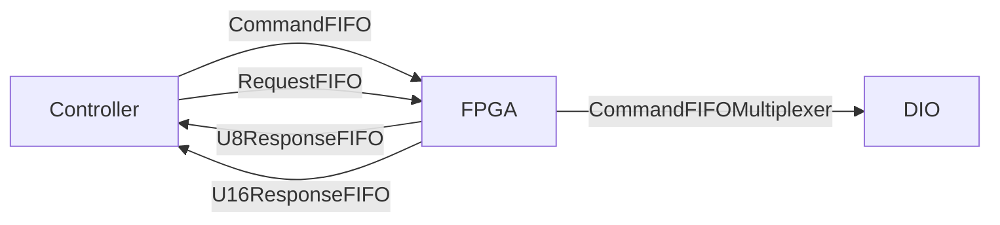

# ts_M1M3ThermalFPGA

## Description

This repo contains the LabVIEW 2018 code of the M1M3 Thermal System FPGA used
by the **ts_M1M3Thermal** software. The FPGA is middleman between [C/C++
control application](https://github.com/lsst-ts/ts_m1m3thermal) and hardware
connected to cRIO.

:warning: Please use **git clone --recursive** to get linked dependencies (Common_ libraries).

## LabView Dependencies

* FPGA Support
* cRIO support
* Real Time support
* [NI Tools Network](https://www.ni.com/labview-tools-network)
  * LabView FPGA Floating-Point Library by NI

If all is installed and setup properly, LabView splash screen will show chip
and clock icons - see [an
example](https://www.evergreeninnovations.co/blog-labview-rt-project/).

:warning: Please use **git clone --recursive** to get linked dependencies (Common_ libraries).

## Build Instructions

Building the FPGA takes just about an hour. As [C++
Controller](https://github.com/lsst-ts/ts_m1m3thermal) is used to talk to FPGA,
you need to generate C API and transfer the bitfile to cRIO, and C header and
source files to src/LSST/M1M3/SS/FPGA directory. Bitfile is loaded by
NiFpga_Open call, and contains binary data send to program the FPGA.

1. Open LabVIEW 2018.
2. Open M1M3ThermalFPGA.lvproj
3. Expand RT CompactRIO Target
4. Expand FPGA Target
5. Expand Build Specifications
6. Select M1M3SupportFPGA
7. Right-Click -> **Build**
8. Select "Use the local compile server" _(it's usually faster than LabView FPGA Compile Cloud)_
9. Click OK
10. Wait for build to successfully finish
  * check CPU usage, there should be process called Vivado taking > 20% CPU time
11. Select M1M3SupportFPGA.vi (under FPGA Target)
12. Right click, select **"Launch C API Generator"**
13. Click **Generate** (after selecting existing output directory and leaving Prefix blank)
14. Copy resulting lvbitx file to ts_m1m3thermal/Bitfiles, and NiFpga_M1M3ThermalFPGA.h to ts_m1m3thermal/src/NiFpga
15. Recompile ts_m1m3thermal (make)

## Overview

This FPGA design is makes heavy use of FIFOs and **S**ingle **C**ycle **T**imed
**L**oop or **SCTL** to move data around the design and keep the size of the
design to a minimum. It is highly recommended that before attempting to make a
change to the design that you familiarize yourself with the quirks within
LabVIEW regarding these two mechanisms.

The design shares commonalities with [M1M3 support
FPGA](https://github.com/lsst-ts/ts_m1m3supportFPGA). Please see it for more
details.

# Controlled devices

* 96x fan ILCs
  * Modbus bus (marked as F, A-E are support system buses)
  * ILCs, details in LTS-646
  * can set target output temperature and fan speed
* Coolant pump
* Mixing valve
* Coolant flow meter
* Windspeed sensor

**Thermocouples located throughout mirror are readout by separate software.**

# DIO assignment

## Slot 1 - [NI 9207](https://www.ni.com/en-us/support/model.ni-9207.html)

| Port | Pin | Assignment                     |
| ---- | --- | ------------------------------ |
| AI0+ | 1   | Amps Monitoring CT7            |
| AI0- | 19  |                                |
| AI1+ | 2   | Amps Monitoring CT8            |
| AI1- | 20  |                                |
| AI2+ | 3   | Mixing valve position          |
| AI2- | 21  |                                |

## Slot 2 - [NI 9265](https://www.ni.com/en-us/support/model.ni-9265.html)

Mixing valve control.

| Port | Pin | Assignment                     |
| ---- | --- | ------------------------------ |
| AO0  | 0   | Mixing valve set point         |
| COM0 | 1   | COM                            |
| Vsup | 8   | 24 V                           |
| GND  | 9   | GND                            |

## Slot 3 - [NI 9401](https://www.ni.com/en-us/support/model.ni-9401.html)

Fans (96x) ILC Modbus.

| Port | Pin | Assignment                     |
| ---- | --- | ------------------------------ |
|DIO 0 | 14  | Subnet F Rx                    |
| Com  | 1   |                                |
|DIO 4 | 20  | Subnet F Tx                    |
| COM  | 7   |                                |

## Slot 4 - [NI 9425](https://www.ni.com/en-us/support/model.ni-9425.html)

| Port | Pin | Assignment                     |
| ---- | --- | ------------------------------ |
| DI0  | 1   | PS 14 Status                   |
| DI1  | 2   | PS 15 Status                   |
| DI2  | 3   | PS 16 Status                   |
| DI3  | 4   | Ctrls Redundancy Status        |
| DI4  | 5   | Fan Coils Diffuser Status      |
| DI5  | 6   | AC Power CB15 Status           |
| DI6  | 7   | Utility outlet CB18 Status     |
| DI7  | 8   | Coolant pump OL status         |
| COM  | 17  | COM                            |
| DI16 | 19  | FC heaters off interlock       |
| DI17 | 20  | Coolant pump off interlock     |
| DI18 | 21  | GIS HB loss interlock          |
| DI19 | 22  | mixing valve closed interlock  |
| DI20 | 23  | Support System HB loss         |
| DI21 | 24  | Cell door open interlock       |
| DI22 | 25  | GIS earthquake interlock       |
| DI23 | 26  | Coolant pump e-stop interlock  |
| DI24 | 27  | Cabinet Over Temp interlock    |

## Slot 5 - [NI 9485](https://www.ni.com/en-us/support/model.ni-9485.html)

| Port | Pin | Assignment                     |
| ---- | --- | ------------------------------ |
| Ch0a | 0   | Ch0 - Fan Coils / Heaters On   |
| Ch0b | 1   | V Sup                          |
| Ch1a | 2   | Thermal System Controller HB   |
| Ch1b | 3   | V Sup                          |
| Ch2a | 4   | Coolant pump On                |
| Ch2b | 5   | V Sup                          |

## Slot 6 - [NI 9871](https://www.ni.com/en-us/support/model.ni-9871.html)

4 port RS-485/422. Connected devices are usually using Modbus connection.

| Port | Pin | Assignment                     |
| ---- | --- | ------------------------------ |
| 1    | NA  | Coolant Pump VFD               |
| 2    | NA  | Flow meter                     |
| 3    | NA  | Wind sensor                    |
| 4    | NA  |                                |

## Slot 7 - [NI 9870](https://www.ni.com/en-us/support/model.ni-9870.html)

| Port | Pin | Assignment                     |
| ---- | --- | ------------------------------ |
| 1    | NA  |                                |
| 2    | NA  |                                |
| 3    | NA  |                                |
| 4    | NA  |                                |

## Slot 8 - spare
